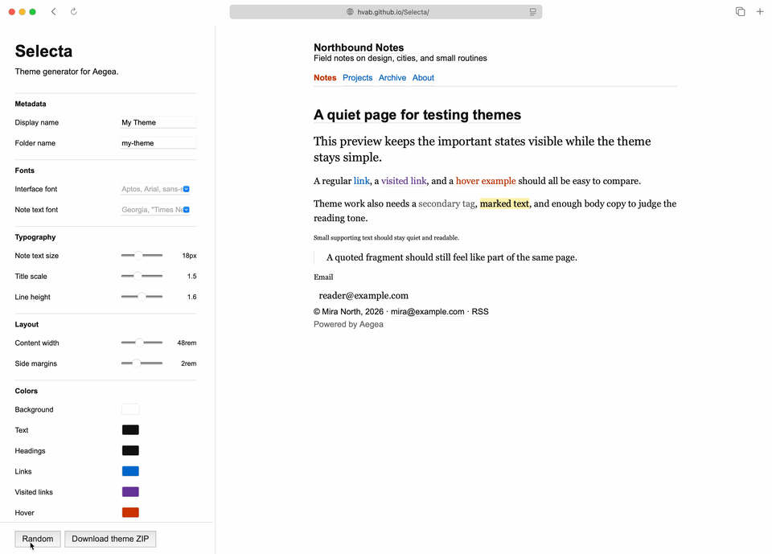

# Selecta

Selecta is a small browser-based theme generator for the [Aegea](https://blogengine.ru) blog engine.

The project is an experiment in making Aegea theme customization more visual and convenient: change theme settings, preview the result, and prepare theme files for further use.

## Preview



Selecta is a work-in-progress tool for creating and testing visual themes for Aegea. It runs in the browser and is deployed as a static site with GitHub Pages.

## Status

Early development.

The project is public, but the interface, generated output, and internal structure may still change.

## Demo

https://hvab.github.io/Selecta/

## Development

```bash
npm install
npm start
```

After startup, the project will be available at the local URL printed by Vite,
usually `http://localhost:5173/Selecta/`.

Build:

```bash
npm run build
```

Preview production build locally:

```bash
npm run preview
```

## Project Flow

The `main` branch is used for active development and GitHub Pages deployment.

For changes, use short-lived branches:

```text
feature/theme-export
fix/pages-build
docs/readme
```

After merging into `main`, GitHub Actions builds the project and deploys it to GitHub Pages.

## License

MIT
